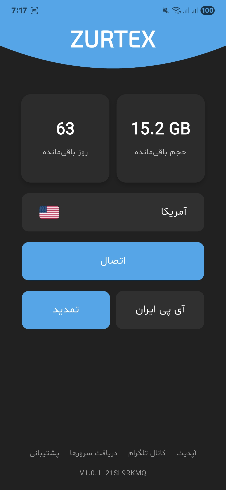
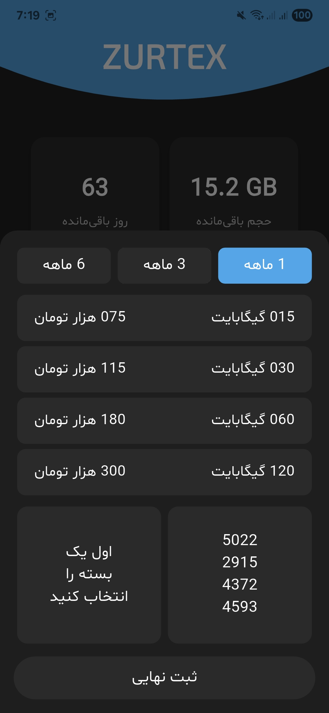

<h1 align="center">📲 Zurtex VPN</h1>

  اپلیکیشن قدرتمند برای اتصال امن، سریع و بی‌دردسر به اینترنت!

---

## 🧾 معرفی

Zurtex VPN یک برنامه اندرویدی ساده و سبک برای اتصال سریع و مطمئن به اینترنت است.  
با سرورهای پرسرعت، بدون نیاز به ثبت‌نام، و پشتیبانی قوی!

---

## 📥 دانلود برنامه

  

---

## 📸 تصاویر محیط برنامه

| صفحه اصلی | اتصال | تمدید |
|-----------|-------------|----------|
|  |  |  |

---

## ✨ ویژگی‌ها

- ⚡ اتصال سریع و پایدار
- 🇮🇷 سرورهای ویژه برای کاربران ایرانی
- 🔐 رمزنگاری کامل ارتباط
- 👤 بدون نیاز به ثبت‌نام
- 🆘 پشتیبانی از طریق تلگرام

---

## 📞 پشتیبانی و ارتباط

- 📢 [کانال تلگرام](https://t.me/ZurtexV2rayApp)
- 🎧 [پشتیبانی](https://t.me/Zurtexapp)

---

## 🛡️ نکته مهم

نسخه‌های قبلی دیگر پشتیبانی نمی‌شوند. لطفاً همیشه آخرین نسخه را از همین صفحه دریافت کنید.

